# Linux SSH Lab

A networking and security lab showcasing automated/manual SSH setup, public key cryptography, and secure data verification between Linux environments.

## 📌 Project Overview
This repository documents the step-by-step process of networking two Linux instances together, establishing a Secure Shell (SSH) connection, and verifying data integrity by securely transferring files between nodes.

## 🛠️ Tech Stack & Environment
* **OS:** Ubuntu Server 26.04 LTS | Linux Mint Cinnamon
* **Hypervisor:** VirtualBox | Hyper-V Architecture (WSL2)
* **Protocols:** SSH (Secure Shell), SFTP (Secure File Transfer Protocol)
* **Crypto:**  ED25519 

## 🛠️ Environment Architecture

* **Node A (Client):** Ubuntu 26.04 LTS | IP: `172.21.136.191`
* **Node B (Server):** Linux Mint Cinnamon | IP: `192.168.1.101`
* **Protocol:** SSH (Port 22)

```mermaid
graph TD
    %% Styling
    style Host fill:#1f2937,stroke:#3b82f6,stroke-width:2px,stroke-dasharray: 5 5;
    style VM1 fill:#111827,stroke:#10b981,stroke-width:2px;
    style VM2 fill:#111827,stroke:#f59e0b,stroke-width:2px;
    style Switch fill:#374151,stroke:#6b7280,stroke-width:1px;

    subgraph Host ["Physical Host (Hypervisor: e.g., VirtualBox / KVM / VMware)"]
        subgraph Switch ["Virtual Network Switch (Host-Only / NAT Network)"]
            Net[IP Subnet: 192.168.56.0/24]
        end

        VM1["Virtual Machine 1 (SSH Client)<br/>Host Name: WSL-Ubuntu-26.04<br/>IP: 172.21.136.191<br/>SSH Key: ~/.ssh/id_ed25519"]
        VM2["Virtual Machine 2 (SSH Server)<br/>Host Name: Linux-Cinnamon-Mint-VM<br/>IP: 192.168.1.101<br/>SSH Service: Port 22"]
    end

    %% Connections
    VM1 <-->|Internal Traffic| Net
    Net <-->|Internal Traffic| VM2
    VM1 ==>|Secure SSH Connection| VM2
```



---

## 🔒 How Public Key Cryptography Works

This lab demonstrates **Asymmetric Cryptography** (Public/Private Key pairs). Instead of relying on vulnerable, brute-forceable passwords, this method uses a pair of mathematically linked cryptographic keys to secure the node connection:

* **The Public Key (The "Lock"):** This key is copied over to the target server (**Node B**). It is safe to share publicly. Its unique job is to encrypt data or verify signatures. Think of it like an open padlock left on a server box.
* **The Private Key (The "Physical Key"):** This key stays securely on the client machine (**Node A**). It must **never** be shared or leaked. It is the only key capable of unlocking what the corresponding public key locked.

### The Authentication Process
1. When **Node A** requests a connection, **Node B** sends a random challenge message encrypted with Node A's public key.
2. Because only **Node A** holds the corresponding Private Key, only Node A can decrypt this specific challenge.
3. Node A decrypts the challenge, signs it with its private key, and sends it back.
4. Node B verifies the signature using the public key and grants shell access.

### Why This Matters in Production
* **Eliminates Password Brute-Forcing:** Automated botnets cannot guess a complex cryptographic key string like they can a standard alphanumeric user password.

---

## 🚀 Lab Steps

### 1. Network Configuration
Verify bi-directional network connectivity between both nodes using the `ping` utility:

```bash
# From Node A (Client)
ping -c 4 172.21.136.191

# From Node B (Server)
ping -c 4 192.168.1.101
```

### 2. Key Generation
On **Node A (Client)**, generate a secure, modern SSH key pair via the ED25519 algorithm:

```bash
ssh-keygen -t ed25519 -C "lab-session"
```
*Press `Enter` to accept the default file location and optional passphrase prompts.*

### 3. Key Distribution
Copy the public key from **Node A** over to **Node B (Server)** to authorize future passwordless logins:

```bash
ssh-copy-id mint@192.168.1.101
```

### 4. Verification & File Transfer
Test the passwordless connection by logging in remotely, and then verify data movement by transferring a test file securely via Secure Copy Protocol (SCP).

```bash
# Test the remote SSH login session
ssh mint@192.168.1.101

# Transfer a sample validation data file from Client to Server using SCP
scp ~/Documents/Humphrey_Bogart/wives mint@192.168.1.101:/mint_shared
```

---

## ☁️ Real-World Considerations: Configuration Drift

While this lab operates in a controlled, single-host environment, identical virtual machines in enterprise production environments often suffer from **Configuration Drift**—the gradual, unintended divergence of system configurations over time due to manual updates, untracked patches, or ad-hoc troubleshooting. 

In SSH architectures, configuration drift commonly manifests as:
* **Host Key Mismatches:** A VM regenerates its host keys unexpectedly, causing the peer VM's `known_hosts` file to flag a critical `"Host key verification failed"` error and break automated pipelines.
* **Authentication Divergence:** One VM receives a manual update to its `/etc/ssh/sshd_config` (e.g., disabling password authentication or enforcing specific MAC ciphers) while another remains unchanged, causing deployments to fail intermittently.
* **Local Firewall Discrepancies:** Unsynchronized changes to local firewalls (`ufw` or `iptables`) block inbound or outbound traffic on port 22 on only a subset of nodes.

### Production Mitigation Strategy
To prevent configuration drift at scale, engineering teams shift away from manual VM configuration and implement automated patterns:

1. **Infrastructure as Code (IaC):** Defining declarative VM networking and cloud provisioning using **Terraform** or OpenTofu.
2. **Configuration Management:** Using **Ansible**, Puppet, or Chef to enforce state compliance on the SSH daemon (`sshd_config`) and distribute authorized keys programmatically across infrastructure.
3. **Immutable Infrastructure:** Deploying standardized "Golden Images" (baked via **Packer**) and replacing virtual nodes entirely instead of patching long-lived systems in place.


